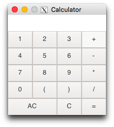
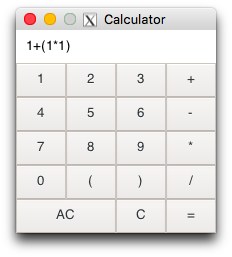

# A Simple Calculator

## Installation

Download/clone the repository, open it in terminal and run `make`.

## Usage

After installation, run `./calc "[expr]"`, where `[expr]` is any (valid) expression involving `0-9`, `(`, `)`, `+`, `-` and `*`.

<b>Note:</b> `[expr]` is evaluated from left to right. So multiplication has no preference over addition. Use parentheses to impose orders.

## GUI Version

```
cd gui/
make
./gui
```

<b>Requirements:</b> [GTK](https://www.gtk.org)

<b>Features:</b>
* 18-character display.
* Supports integer division.
* Invalid expressions return `0`.

|
